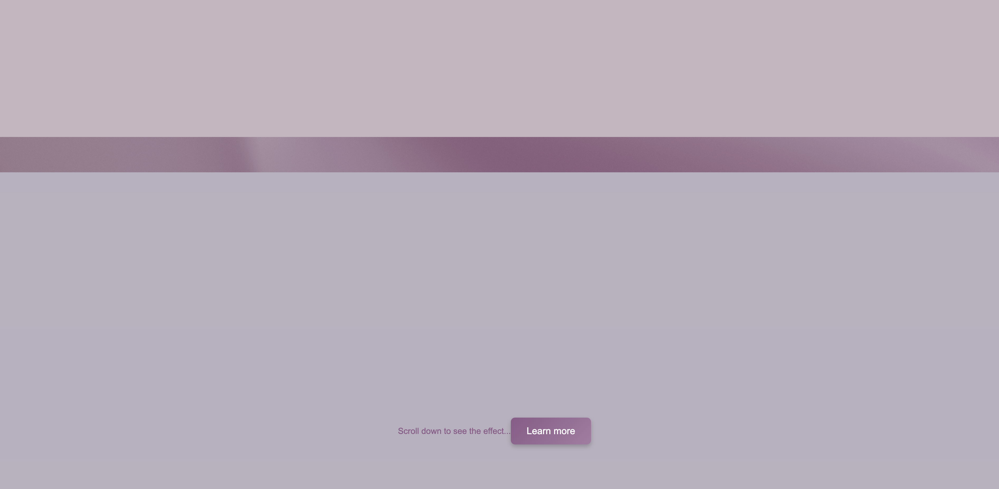

# Parallax Scrolling Effect

This mini-project explores the parallax scrolling effect and its application.

- [Parallax Scrolling Effect](#parallax-scrolling-effect)
  - [Overview](#overview)
    - [The Challenge](#the-challenge)
    - [Links](#links)
  - [Screenshots](#screenshots)
  - [My Process](#my-process)
    - [Built With](#built-with)
    - [What I Learned](#what-i-learned)
    - [Continued Development](#continued-development)
    - [Useful Resources](#useful-resources)
  - [Author](#author)

## Overview

### The Challenge

- Implement a parallax scrolling effect with smooth transitions between sections.
- Ensure the design is visually appealing and responsive across different devices.
- Incorporate basic styling for sections and buttons.

### Links

- Repository: [GitHub Repo](https://github.com/Doileo/parallax-animation)
- Live Site URL: [GitHub Pages Link]()

## Screenshots

<table>
  <tr>
    <td>
      <strong>Desktop View</strong> 
       
    </td>
    <td>
      <strong>Mobile View</strong> 
       
    </td>
  </tr>
</table>

## My Process

### Built With

- HTML5 for structure
- CSS for styling and parallax effect
- JavaScript for smooth scrolling interaction

### What I Learned

- Implemented a parallax scrolling effect using CSS background properties and JavaScript.
- Used CSS to overlay colors on the parallax background for a layered look.
- Improved my skills in responsive design and optimizing images for different screen sizes.

### Continued Development

In future projects, I aim to:

- Explore more advanced parallax techniques and libraries.
- Enhance accessibility and performance.
- Experiment with interactive elements and animations.

### Useful Resources

- [CSS Tricks - Parallax Scrolling](https://css-tricks.com/parallax-backgrounds/)
- [MDN Web Docs - Background Attachment](https://developer.mozilla.org/en-US/docs/Web/CSS/background-attachment)
- [JavaScript - Window Scroll Event](https://developer.mozilla.org/en-US/docs/Web/API/Window/scroll_event)

## Author

- LinkedIn - [@Doina](https://www.linkedin.com/in/doinaleovchindeveloper/)
